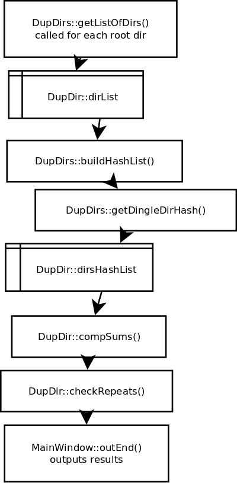

% README file
% Craig Dawson
% 2014-11-03 16:22

# License

## From cxd_license.h:

    The MIT License (MIT)

    Copyright (c) 2014 Craig Dawson

    Permission is hereby granted, free of charge, to any person obtaining a copy
    of this software and associated documentation files (the "Software"), to deal
    in the Software without restriction, including without limitation the rights
    to use, copy, modify, merge, publish, distribute, sublicense, and/or sell
    copies of the Software, and to permit persons to whom the Software is
    furnished to do so, subject to the following conditions:

    The above copyright notice and this permission notice shall be included in
    all copies or substantial portions of the Software.

    THE SOFTWARE IS PROVIDED "AS IS", WITHOUT WARRANTY OF ANY KIND, EXPRESS OR
    IMPLIED, INCLUDING BUT NOT LIMITED TO THE WARRANTIES OF MERCHANTABILITY,
    FITNESS FOR A PARTICULAR PURPOSE AND NONINFRINGEMENT. IN NO EVENT SHALL THE
    AUTHORS OR COPYRIGHT HOLDERS BE LIABLE FOR ANY CLAIM, DAMAGES OR OTHER
    LIABILITY, WHETHER IN AN ACTION OF CONTRACT, TORT OR OTHERWISE, ARISING FROM,
    OUT OF OR IN CONNECTION WITH THE SOFTWARE OR THE USE OR OTHER DEALINGS IN
    THE SOFTWARE.

# Overview

  The technical goals of this project is to understand some of the new features
in C++11.  Use Qt in a fundamental way and do some cross platform
development.

  The algorithmic goals are to prove the basic algorithm works for
producing a "Go/No Go" directory difference test that is much faster than
comparing every file.

  Time to market and process methods (both very important in commercial
development) were not a concern here.

  The key modules are dupdir.h and dupdir.cpp (DupDir class) and their
supporting modules.  Little focus was given to the GUI and Qt.
Leveraging off of open source and posted solutions was taken advantage
of.  Although, posted solutions normally required heavy modification to
work in a realistic application.

## Algorithm

  The basic idea was given two root directories to compare, do the
following to each directory:

    $ find . -maxdepth 1 -type f -exec ls -l {} \; \
      | awk '{print $5, $9}' | sort -n | sha256sum

  Save the hashes returned by a sha1sum algorithm, sort them, and look
for pairs.  Since the key data is the file size and file name in each
directory, this doesn't give 100% accurate results but is close enough
for most purposes.

  A variation on the method, still faster than running 'diff' on files,
is to get a sha256sum on each file and store that along with the file
name.  Then sort them and look for pairs.

## General Flow

  Figure 1 below shows the general flow of how the DupDir class is
called from MainWindow pushbutton clicked routine.  dirList and
dirsHashList are the two main data structures.

## Cross Platform

  The project can be build under Linux and OS X.  There is a known short
coming in OS X with respect to relative paths and all the work-around
code for it hasn't been supplied.  Therefore only absolute paths work in
OS X.  Linux is the recommended OS.

# Building

  Originally built on Ubuntu 14.10 and OS X 10.10

## Requirements

  * Qt 5

  * [hashlib++](http://hashlib2plus.sourceforge.net/) [modified version
    of 0.3.4 included]

  * g++ 4.9.1 [Linux]

  * Apple LLVM version 6.0 (clang-600.0.54) (based on LLVM 3.5svn) [OS X]

  * regular development tools (make, etc.)

## Method

  * $ ./build_all.sh    # build hashlib++ and dupdirs

  * $ ./very_clean.sh   # remove all binaries, even lib and app

### To rebuild app only:

  #. $ qmake

  #. $ make

  #. $ ./dupdirs root1 root2  [linux]

  #. $ open dupdirs.app --args root1 root2 [OS X]

# Releases

  * 1.0 Initial release

